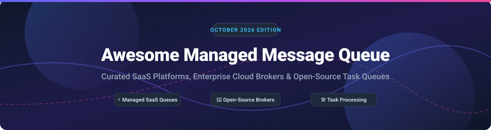

# 🚀 Awesome Managed Message Queue

  
  
  
  
  

## 📌 Top Managed Message Queue & Task Processing Ecosystem

**Comprehensive Curated Guide to Commercial SaaS Platforms, Cloud Message Brokers & High-Star Open-Source Projects**

*Focused on Managed Queuing, Cloud Task Processing, Distributed Message Streaming & Self-Hosted Message Brokers.*

**Last updated: October 2026**

---

### 💡 Overview & Ecosystem Insights

This repository tracks notable **commercial managed message queue SaaS platforms**, **cloud-native event streaming services**, and **open-source task queues / message brokers**. These tools help engineers decouple distributed microservices, buffer heavy asynchronous workloads, handle background jobs, rate-limit APIs, and guarantee event delivery.

#### 📊 Market Size & Industry Fragmentation
> **Market Intelligence**: The global Message Queue and Middleware Market is estimated at **~$7.8 Billion in 2026** (projected to exceed **$14.5 Billion by 2031** at a ~13.2% CAGR). The sector is **moderately fragmented**: hyper-scaler cloud providers (AWS, Azure, GCP) command the largest share of commodity queuing, while specialized managed providers (Confluent, Upstash, CloudAMQP) and open-source ecosystems (RabbitMQ, Apache Kafka, NATS, Redis/BullMQ) capture high-growth specialized niches in real-time streaming, serverless workflows, and developer-first infrastructure.

---

## 📚 Table of Contents

- [☁️ SaaS / Hosted Message Queue Platforms](#️-saas--hosted-message-queue-platforms)
- [🔓 Open-Source GitHub Projects](#-open-source-github-projects)
  - [📬 Message Brokers & Event Streaming](#-message-brokers--event-streaming)
  - [⚙️ Task Queues & Background Job Processing](#️-task-queues--background-job-processing)
  - [☸️ Kubernetes-Native Queuing](#%EF%B8%8F-kubernetes-native-queuing)
  - [🛠️ Additional Open-Source Messaging Libraries](#%EF%B8%8F-additional-open-source-messaging-libraries)
- [📈 Star History](#-star-history)
- [💖 Support & Sponsorship](#-support--sponsorship)
- [🤝 How to Contribute](#-how-to-contribute)
- [⚠️ Disclaimer & Architectural Best Practices](#%EF%B8%8F-disclaimer--architectural-best-practices)

---

## ☁️ SaaS / Hosted Message Queue Platforms

Commercial cloud message queuing solutions sorted by estimated company valuation / revenue (descending).

| SaaS Platform | Company Valuation / Revenue | Starting Tier Price | Free Tier Limit / Trial | Best For & Key Features |
| :--- | :--- | :--- | :--- | :--- |
| **[Amazon SQS](https://aws.amazon.com/sqs/)** | **~$600B+** *(AWS Share of Amazon's $2T+ Cap)* | **$0.40 per 1M requests** (Standard Queues) | **1,000,000 requests/month free** forever | AWS-native applications. Fully managed standard & FIFO queues, visibility timeouts, dead-letter queues (DLQ), and unlimited horizontal throughput. |
| **[Azure Queue Storage](https://azure.microsoft.com/en-us/products/storage/queues/)** | **~$450B+** *(Azure Share of MSFT's $3T+ Cap)* | **$0.045 per 10,000 transactions** + storage ($0.025/GB) | **5 GB storage & 20,000 read/write operations free/month** (via Azure Free Account for 12 months) | Azure-native enterprise queuing. Simple HTTP/REST accessible queue storage with massive scalability. |
| **[Google Cloud Tasks](https://cloud.google.com/tasks)** | **~$250B+** *(GCP Share of Alphabet's $2T+ Cap)* | **$0.40 per 1M operations** | **1,000,000 operations/month free** forever | GCP-native serverless task processing. Asynchronous task execution, precise rate limiting, scheduled dispatch, and automatic retries. |
| **[Amazon MQ](https://aws.amazon.com/amazon-mq/)** | **~$600B+** *(AWS Share of Amazon's $2T+ Cap)* | **$0.0576/hour** (~$42/month for single-AZ `mq.t3.micro`) | **750 hours/month of single-AZ `mq.t3.micro` free for 12 months** | Managed Apache ActiveMQ & RabbitMQ. Broker-level DLQ, native JMS, AMQP, STOMP, MQTT protocols without operational overhead. |
| **[Apache Pulsar (StreamNative Cloud)](https://streamnative.io/)** | **~$150M+** *(StreamNative Series B)* | **$0.10/hour** (~$72/month developer cluster) | **$300 free cloud credits valid for 30 days** | Multi-tenant event streaming & queuing. Geo-replication, tiered storage, negative acknowledgments, and dead-letter topics. |
| **[RabbitMQ Cloud (CloudAMQP)](https://www.cloudamqp.com/)** | **~$50M+** *(84codes ARR / Valuation)* | **$99/month** (Dedicated "Lemur" Instance) | **1,000,000 messages/month free** forever ("Little Lemur" Shared Plan) | Production RabbitMQ as a service. AMQP 0-9-1, MQTT, STOMP, flexible exchange routing, and automated cluster management. |
| **[Celery Cloud (CloudAMQP)](https://www.cloudamqp.com/)** | **~$50M+** *(84codes ARR / Valuation)* | **$99/month** (Dedicated Managed RabbitMQ Backend) | **1,000,000 messages/month free** forever ("Little Lemur" Shared Plan) | Managed Python task queues. Fully hosted message broker optimized for Python Celery workers and distributed task distribution. |
| **[Upstash QStash](https://upstash.com/qstash)** | **~$30M+** *(Venture-backed Upstash)* | **$1.00 per 100,000 messages** (Pay-as-you-go Plan) | **500 messages/day free** forever | Serverless & edge HTTP messaging. Designed for Next.js, Cloudflare Workers, and Vercel serverless background workflows. |
| **[BullMQ Pro](https://bullmq.io/)** | **~$15M+** *(Taskforce.sh Bootstrapped)* | **€99/month** (BullMQ Pro Starter License) | **14-day full feature free trial** (Unlimited local dev usage) | Commercial Node.js & TypeScript job queue. Advanced priority queuing, rate-limiting, batch jobs, and enterprise web UI dashboards. |
| **[ActiveMQ Cloud](https://activemq.apache.org/)** | **N/A** *(Community SaaS Hosted)* | **$49/month** (Typical Managed Hosted ActiveMQ) | **14-day free trial** | Legacy enterprise JMS cloud hosting. JMS 1.1/2.0 compliance, redelivery policies, and enterprise Java application messaging. |

---

## 🔓 Open-Source GitHub Projects

Top open-source message brokers, task queue frameworks, and Kubernetes autoscalers. Ranked strictly by **GitHub Stars_Count (descending)**.

### 📬 Message Brokers & Event Streaming

| Project & Repo Link | GitHub Stars_Count | License | Key Features & Best Use Case |
| :--- | :--- | :--- | :--- |
| **[Apache Kafka](https://github.com/apache/kafka)** |  | Apache-2.0 | **The de facto standard for distributed event streaming.** High-throughput pub/sub, log persistence, Kafka Connect ecosystem, and event-driven architectures. |
| **[NATS](https://github.com/nats-io/nats-server)** |  | Apache-2.0 | **Cloud-native, ultra-high-performance messaging system.** Lightweight pub/sub with JetStream persistence layer, built-in key-value & object store capabilities. |
| **[Apache Pulsar](https://github.com/apache/pulsar)** |  | Apache-2.0 | **Multi-tenant cloud-native messaging and streaming.** Decoupled compute and BookKeeper storage, native geo-replication, dead-letter topics, and multi-protocol adapters. |
| **[RabbitMQ](https://github.com/rabbitmq/rabbitmq-server)** |  | MPL-2.0 | **Most widely deployed open-source AMQP message broker.** Flexible exchange routing, priority queues, TTL, and robust dead-letter exchanges (DLX). |
| **[NSQ](https://github.com/nsqio/nsq)** |  | MIT | **Real-time distributed messaging platform in Go.** Designed to operate at scale without single points of failure, low latency, and straightforward topologies. |
| **[ZeroMQ](https://github.com/zeromq/libzmq)** |  | MPL-2.0 | **High-performance asynchronous messaging library.** Brokerless socket library carrying messages across inter-process, TCP, and multicast transports. |
| **[Apache ActiveMQ](https://github.com/apache/activemq)** |  | Apache-2.0 | **Veteran multi-protocol Java message broker.** Full JMS 1.1 support, AMQP, STOMP, MQTT, and reliable enterprise dead-letter queue policies. |
| **[Apache ActiveMQ Artemis](https://github.com/apache/activemq-artemis)** |  | Apache-2.0 | **High-performance non-blocking messaging broker.** Next-generation ActiveMQ supporting JMS 2.0 with asynchronous IO engine. |

---

### ⚙️ Task Queues & Background Job Processing

| Project & Repo Link | GitHub Stars_Count | License | Key Features & Best Use Case |
| :--- | :--- | :--- | :--- |
| **[Celery](https://github.com/celery/celery)** |  | BSD-3-Clause | **Distributed task queue for Python.** Real-time task processing with RabbitMQ or Redis backends, task retries, scheduling, and canvas workflows. |
| **[Sidekiq](https://github.com/sidekiq/sidekiq)** |  | LGPL-3.0 | **Simple, efficient background processing for Ruby.** Multi-threaded Redis-backed job processing with automatic retries and dead job set management. |
| **[RQ (Redis Queue)](https://github.com/rq/rq)** |  | BSD-2-Clause | **Simple Python library for queueing jobs with Redis.** Lightweight, easy setup, and transparent job monitoring for Python backend apps. |
| **[Beanstalkd](https://github.com/beanstalkd/beanstalkd)** |  | MIT | **Fast, general-purpose work queue protocol.** In-memory job queue with delay, TTR (Time To Run), and priority semantics. |
| **[Hatchet](https://github.com/hatchet-dev/hatchet)** |  | MIT | **Distributed task orchestrator for modern applications.** Durable execution, retries, concurrency limits, and cross-language worker SDKs. |
| **[BullMQ](https://github.com/taskforcesh/bullmq)** |  | MIT | **Fast & reliable Redis-based queue for NodeJS and Python.** Priority queues, rate-limiting, parent-child job dependencies, and exponential backoff. |
| **[Resque](https://github.com/resque/resque)** |  | MIT | **Redis-backed Ruby library for creating background jobs.** Multiple queues, fork-per-job processing, and administrative monitoring web dashboard. |
| **[Dramatiq](https://github.com/Bogdanp/dramatiq)** |  | LGPL-3.0 | **Fast and reliable background task processing library for Python.** High message throughput, low memory overhead, and native dead-letter queues. |

---

### ☸️ Kubernetes-Native Queuing

| Project & Repo Link | GitHub Stars_Count | License | Key Features & Best Use Case |
| :--- | :--- | :--- | :--- |
| **[KEDA](https://github.com/kedacore/keda)** |  | Apache-2.0 | **Kubernetes Event-driven Autoscaling.** Automatically scales K8s pods from 0 to N based on queue depth (SQS, RabbitMQ, Kafka, Redis). |
| **[KubeMQ Community](https://github.com/kubemq-io/kubemq-community)** |  | Apache-2.0 | **Kubernetes-native message queue and broker.** Ultra-lightweight containerized messaging with pub/sub, queue pattern, and gRPC endpoints. |

---

### 🛠️ Additional Open-Source Messaging Libraries

* **[Redis Streams & Pub/Sub](https://github.com/redis/redis)** — In-memory log-based persistent streams and low-latency publish/subscribe messaging.
* **[Laravel Horizon](https://github.com/laravel/horizon)** — Beautiful dashboard and code-driven configuration for Redis queues in Laravel applications.
* **[Apache Qpid](https://github.com/apache/qpid-broker-j)** — Enterprise AMQP 1.0 messaging broker written in Java.
* **[Kombu](https://github.com/celery/kombu)** — Messaging library for Python designed to decouple message consumers and producers with uniform API.
* **[WakaQ](https://github.com/waka-q/wakaq-python)** — Background task queue for Python with Gevent workers and Redis storage.
* **[Gearman](https://github.com/gearman/gearmand)** — Multi-language job server designed to farm out work to multiple machines or tasks.
* **[Disque](https://github.com/antirez/disque)** — Distributed, in-memory job queue created by Salvatore Sanfilippo (Redis creator).

---

## 📈 Star History

---

## 💖 Support & Sponsorship

Thank you for exploring the **Awesome Managed Message Queue** ecosystem! 🚀

If this curated repository saved you time, helped you architect your backend queue system, or introduced you to useful tools, please consider supporting the project:

- ⭐ **Star this repository** to help others discover it on GitHub.
- 🔀 **Fork & Share** it with your developer network, backend teams, and DevOps colleagues.
- 🤝 **Contribute** new managed queue platforms or open-source libraries via Pull Requests.
- ☕ **Buy me a coffee**: Support ongoing open-source maintenance on the [GitHub Sponsor Dashboard](https://github.com/sponsors/ishandutta2007).

---

## 🤝 How to Contribute

1. **Fork** this repository.
2. Add or update entries in `README.md` maintaining table formatting, pricing, and exact Stars_Badges.
3. Keep descriptions concise, factual, and links directed to official documentation.
4. Submit a **Pull Request** with a clear title and description.

---

## ⚠️ Disclaimer & Architectural Best Practices

- **Community Curated**: This list is maintained for informational and educational purposes — not an official endorsement.
- **Dead Letter Queues (DLQ)**: DLQs are mandatory for production message queues. Without a configured DLQ and visibility timeout, unhandled consumer exceptions cause infinite poison-pill retry loops.
- **Backoff & Jitter**: Always implement exponential backoff with randomized jitter when retrying failed tasks to prevent thundering herd failures on downstream databases.
- **License Compliance**: Verify open-source licenses (MPL-2.0, Apache-2.0, LGPL, BSD) prior to embedding brokers in enterprise products.

---

  <b>Maintained with ❤️ for Backend Engineers, Cloud Architects, and Distributed Systems Developers.</b>

